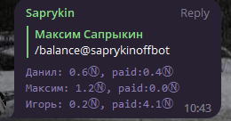
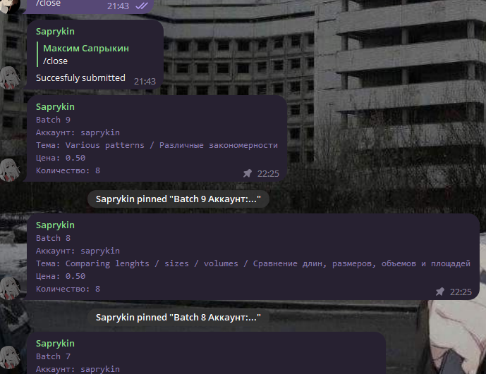
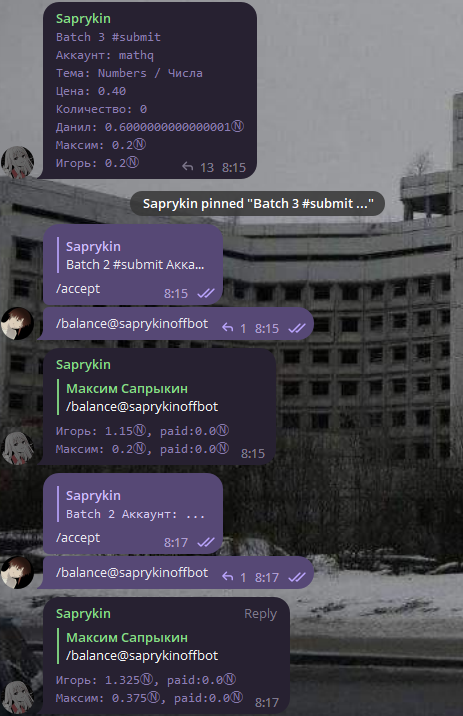
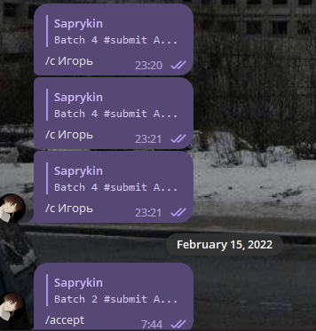

# StarFishManager

Идея:

Был сервис, который платил за определенные картинки, 
я эту работку скинул на других и платил им процент.

Есть понятие задание и пачка - набор из нескольких заданий.
Оплата приходит только за пачку, в то время как внутри пачки задачи независимы и могут выполнятся разными людьми

Чтобы не держать в голове кому сколько должен
(выплата в крипте, выводил не сразу) написал этого бота, чтобы он поддерживал баланс и следующие операции:
-Создать пачку из $n$ заданий, с названием $title$ и оплатой $p$ N за задание (Админ)
-Отметить пачку выполненой (Админ)
-Отметить пачку оплаченой(начисляются деньги на локальный счет) (Админ)
-Посмотреть баланс всех людей (Юзер)
-Зарезервировать задачу(Юзер)
-Сдать задачу(Юзер)!

